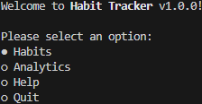
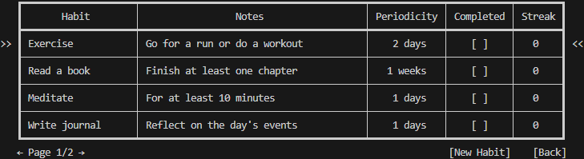
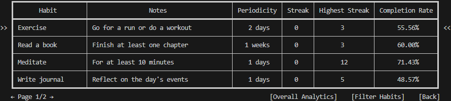
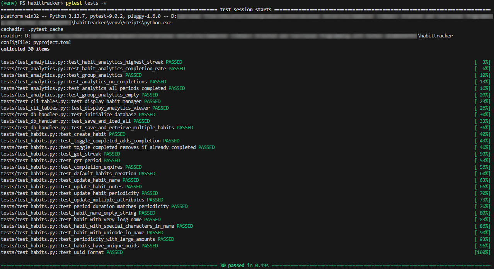

# HabitTracker

A Python-based CLI habit tracking app to create, track, and analyze habits.

## Key Features

- **Command-line interface (CLI)**
  Interactive, keyboard-driven terminal UI with menus and tables for managing habits and analytics.

- **Habit management**
  - Create, edit, and delete habits.
  - Each habit has a name, optional notes, and a configurable periodicity.
  - Habits can be marked complete or incomplete within their current period.
  - A habit must be completed at least once within each period to maintain a streak.

- **Analytics module**
  - View analytics per habit or across groups of habits.
  - Metrics include:
    - Current streak
    - Highest (longest) streak
    - Completion rate over a selected time range

- **Persistent storage**
  - Habit data is stored in a local SQLite database.
  - Persists habits, periods, and completion timestamps between runs.
  - Automatically initializes the database schema on first launch.

- **Default data**
  - On first run, the app creates 5 predefined habits with 4 weeks of sample data.
  - These defaults provide example tracking data suitable for testing and evaluation, as required by the course assignment.
  - New habits can be created interactively via the CLI.

## Installation

1. Install Python 3.9+ from [the official website](https://www.python.org/downloads/).

2. Clone the repository:
    ```ps
    git clone "https://github.com/Ali246801232/habittracker-DLBDSOOFPP.git" habittracker
    cd habittracker
    ```

3. Set up a virtual environment (optional but recommended):
    ```ps
    python -m venv venv
    .\venv\Scripts\activate
    ```

4. Install the app as a package:
    ```ps
    pip install .
    ```

5. Run HabitTracker:
    ```ps
    habittracker
    ```

## Usage

Upon launching the app, you will see the main menu:



---

Selecting `Habits` will open a table interface to view and manage your habits, similar to the following:



Then, to interact with the table, you can:
- Create a new habit by pressing the `New Habit` button.
- Press ENTER with a habit selected to mark it complete/incomplete, modify it, or delete it.
- Return to the main menu by pressing the `Back` button.

A habit, once completed, remains completed until the period ends or unless marked incomplete.

---

Selecting `Analytics` will open a table interface, similar to the following:



Then, to interact with the table, you can:
- View the analytics of all habits within the filter by pressing `Overall Analytics`.
- Filter habits by pressing `Filter Habits` (by periodicity or dates).
- Return to the main menu by pressing `Back`.

## Testing

Core logic is designed to be testable independently of the CLI.
A number of existing unit tests have been made using `pytest`, and can be run as follows:
1. Install dev requirements:
    ```ps
    pip install -e .[dev]
    ```
2. Run tests:
    ```ps
    pytest tests
    ```

Currently, the following tests exist and pass:



For interactive experimentation (time travel, resetting the database, etc.) a manual testing harness is provided. It uses its own temporary database and restores to a blank state when you exit.

```ps
habittracker --manual-test
# or
habittracker -m
```

The harness presents a small menu that lets you:

1. **Run App** - start the normal habit tracker CLI using the temporary database.
2. **Change Date** - pick a new "current" date.
3. **Reset Database** - wipe and recreate the temporary database.
4. **Exit** -  leave the harness (the temporary database is deleted automatically).

## License

This project is licensed under the MIT license. See [LICENSE](LICENSE) for details